## Using sed utility
### 1- Display the lines that contain the word “lp” in /etc/passwd file.

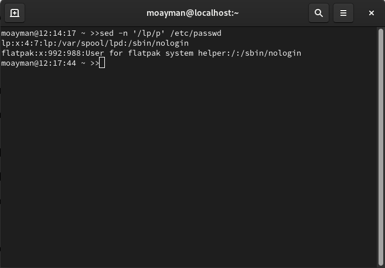

### 2- Display /etc/passwd file except the third line.

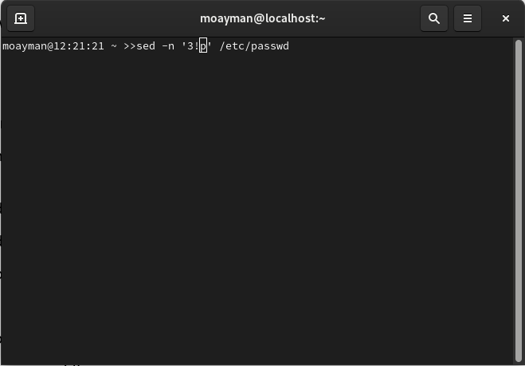

### 3- Display /etc/passwd file except the last line.

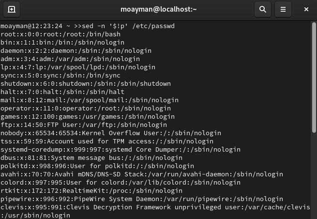

### 4- Display /etc/passwd file except the lines that contain the word “lp”.

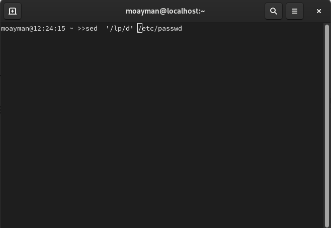

### 5- Substitute all the words that contain “lp” with “mylp” in /etc/passwd file.

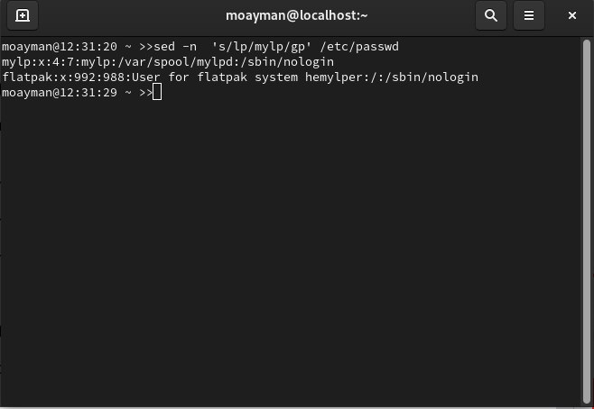

## Using awk utility
### 1- Print full name (comment) of all users in the system.

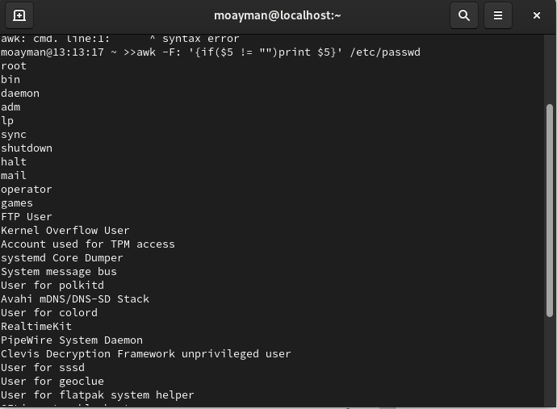

### 2- Print login, full name (comment) and home directory of all users.( Print each line preceded by a line number)

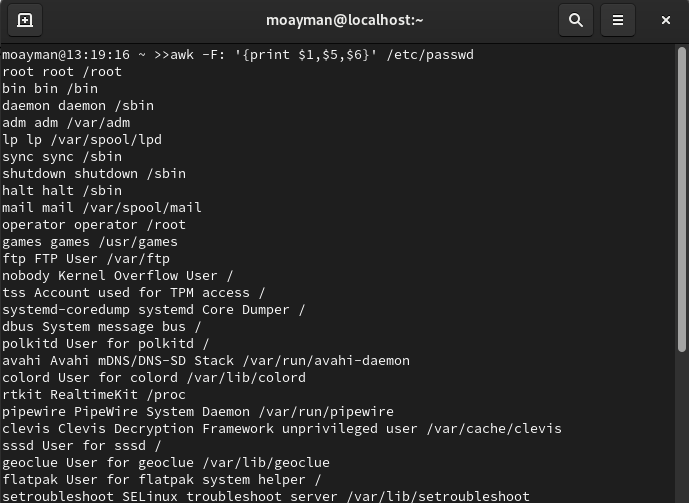

### 3- Print login, uid and full name (comment) of those uid is greater than 500

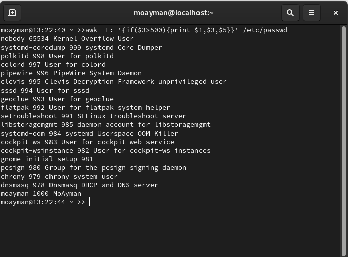

### 4- Print login, uid and full name (comment) of those uid is exactly 500

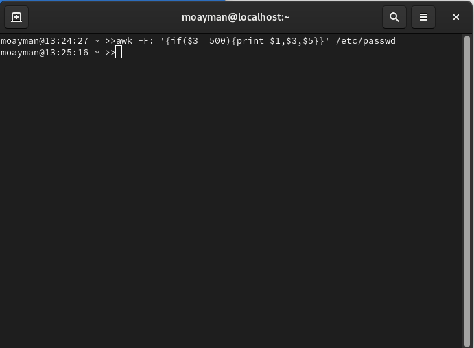

### 5- Print line from 5 to 15 from /etc/passwd

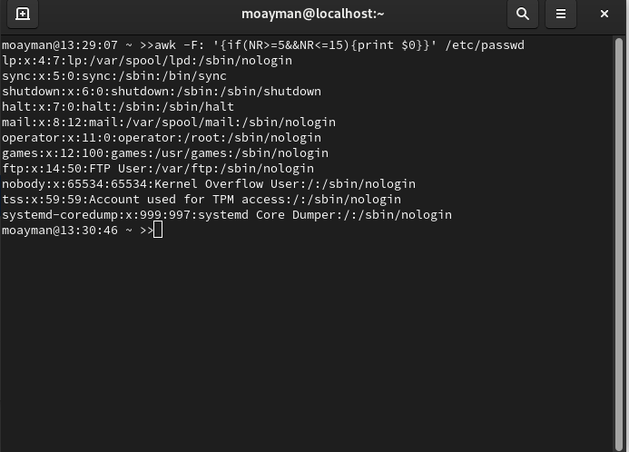

### 6- Change lp to mylp

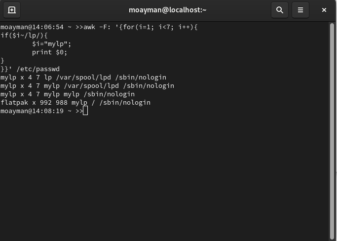

### 7- Print all information about greatest uid.

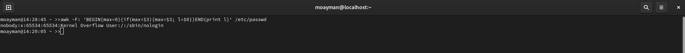

### 8- Get the sum of all accounts id’s.

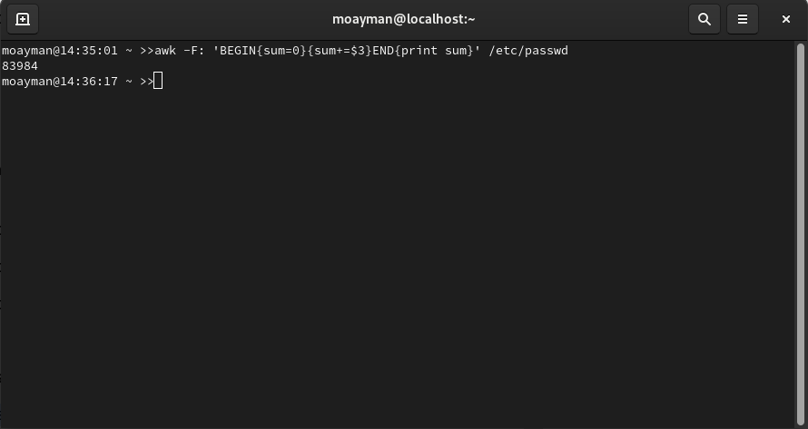
