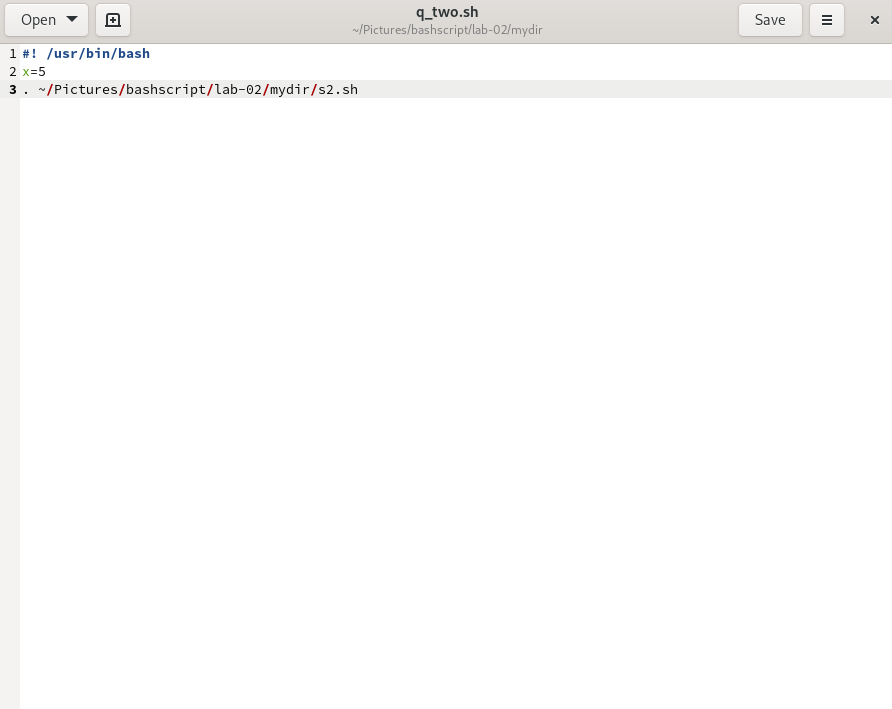

##[Lab 2]<br />
#q1 - <br />


--------------------------------------------------------
#q2 - <br />




---------------------------------------------------------
#q3 - <br />

-----------------------------------------------------------
#q4 - <br />


----------------------------------------------------------
#q5 - <br />
```
#! /usr/bin/bash
ls $1
```
----------------------------------------------------------
#q6 - <br />
```
#! /usr/bin/bash
ls $1
```
-----------------------------------------------------------
#q7 - <br />
```
#! /usr/bin/bash
if [ -f "$1" ]; then
    echo "It is a file."
elif [ -d "$1" ]; then
    echo "It is a directory."
else
    echo "It is neither a file nor a directory, or the path does not exist."
fi

stat -c "%A" "$1"
```
-----------------------------------------------------------
#q8 - <br />
```
#! /usr/bin/bash
read -p "Enter your logname" logname
ls -l /home/"$logname"
cp /home/"$logname" /temp
ps -u "$logname"
```
-----------------------------------------------------------
